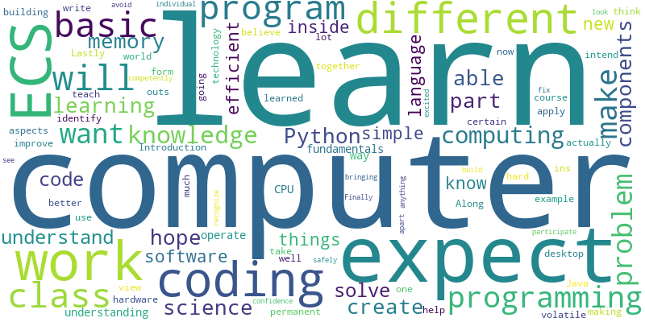

## Description
*docxWordCloud* was orignally created for an intro CS course. We asked students to tell us, the instructors, about their expectation for the cuorse. They answered the questions in a multi-page lab assignment and submmitted in .docx format.

This tool was then created to extract the answers from all files, and generate text into a wordcloud for a visual representation of most frequent words.

## Usage
*docxWordCloud only supports extracting content from docx so far.*
The program searches for each paragraph in a docx file, and will extract
text from searchIndex up to a deliminator point.

> python3 extract.py

### A sample output

## Dependencies
Python 3.6 or above
- docx
- wordcloud
- gensim
- nltk

